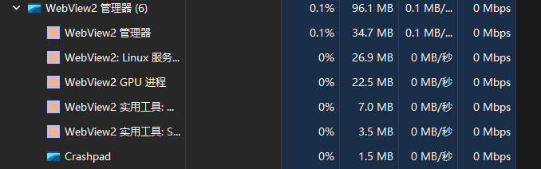
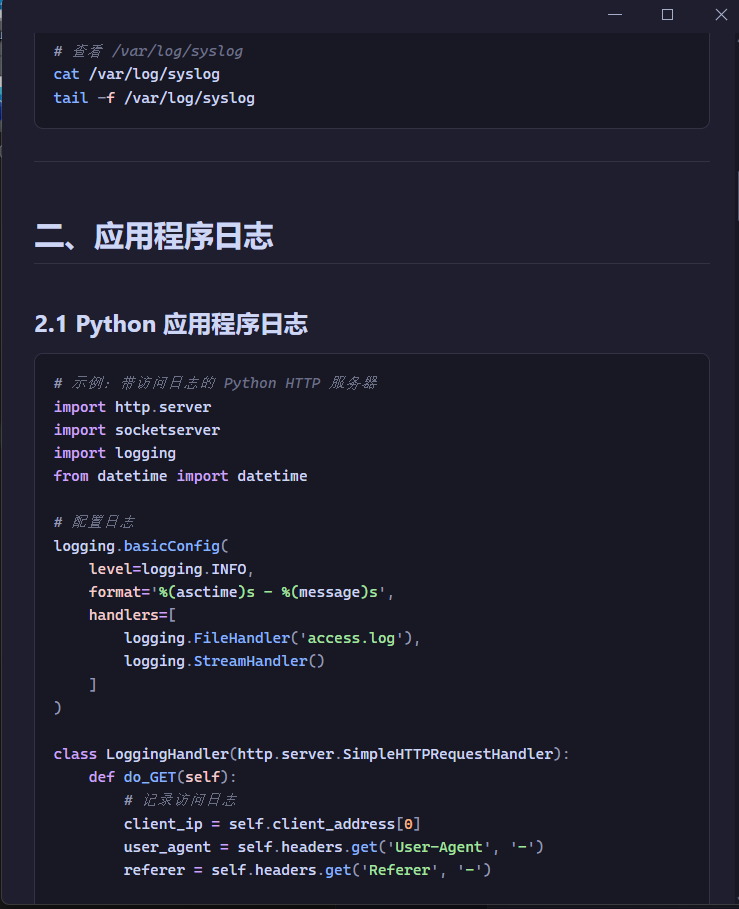
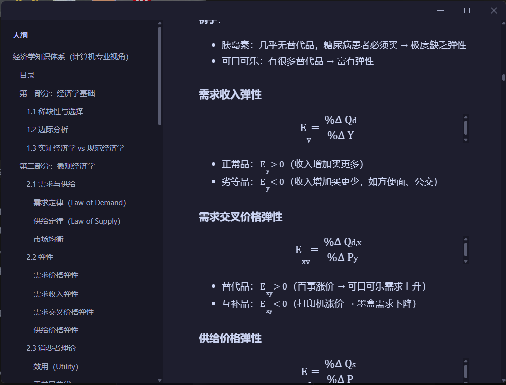

# Markdown Reader

[简体中文](./README-zh.md)

connect to author：[jksheng.top](https://jksheng.top "jksheng's blog")

Ultra-lightweight Windows Markdown Reader with sub-second cold start. Read-only viewer for local `.md` / `.markdown` files — no editing, saving, cloud sync, plugins, file manager, or background service.



## MVP

- Tauri v2 + vanilla HTML/CSS/JS. No Electron, Vite, or frontend frameworks.
- Rust reads Markdown locally, generates HTML, TOC, heading anchors, and syntax highlighting.
- Default theme: Catppuccin Mocha.
- Open from command line: `md-reader.exe path\to\file.md`.
- Packaging preconfigured for `.md` / `.markdown` Windows file association.

## Features

- Syntax highlighting


- LaTeX math rendering


## Dependencies

- `tauri` / `tauri-build`: Windows desktop shell, IPC, and packaging.
- `pulldown-cmark`: Lightweight Markdown parser.
- `syntect`: Local syntax highlighting, no network requests.
- `ammonia`: HTML sanitization, restricts scripts and unsafe protocols.
- `base64` / `mime_guess`: Inline local relative images as data URLs, avoids direct file access from frontend.
- `serde` / `thiserror` / `html-escape`: Serialization, error handling, and HTML escaping.

## Build

```powershell
pnpm install
cargo check --manifest-path src-tauri\Cargo.toml
pnpm build
```
